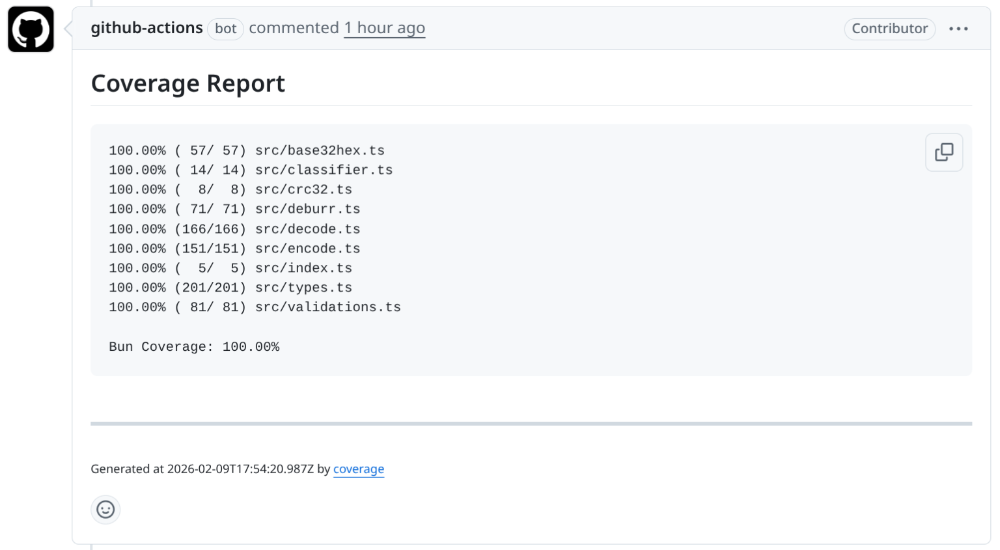
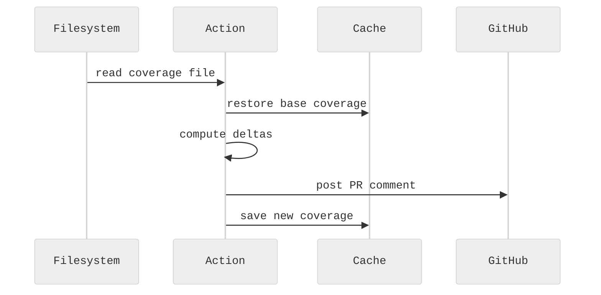

<h1 align="center">coverage</h1>

<p align="center">
	GitHub Action that parses coverage files and posts sticky PR comments with per-file deltas.
</p>

<p align="center">
	<a href="#features">Features</a> •
	<a href="#usage">Usage</a> •
	<a href="#inputs">Inputs</a> •
	<a href="#outputs">Outputs</a> •
	<a href="#generating-coverage-files">Coverage Files</a> •
	<a href="#development">Development</a>
</p>

## Why

Most coverage reporting actions require third-party services or complex setups.
This action works entirely within GitHub Actions using built-in cache, supports
multiple languages, and shows meaningful per-file diffs without external dependencies.

## Features

- Supports any LCOV-producing tool (Bun, Jest, c8, nyc, Istanbul, PHPUnit, …) and Go coverage
- Shows per-file coverage deltas against base branch
- Single sticky PR comment (updates existing, no spam)
- Uses `@actions/cache` for cross-run comparison
- Optional thresholds and fail-on-decrease
- No external services or tokens required

## Usage

```yaml
- uses: xseman/coverage@v0.2.0
  with:
      coverage-artifact-paths: bun:coverage/lcov.info
```

With multiple tools and thresholds:

```yaml
- uses: xseman/coverage@v0.2.0
  with:
      coverage-artifact-paths: |
          bun:coverage/lcov.info
          go:coverage.out
      fail-on-decrease: true
      coverage-threshold: 80
```

Full workflow:

```yaml
name: Coverage
on: pull_request

jobs:
    test:
        runs-on: ubuntu-latest
        steps:
            - uses: actions/checkout@v6
            - uses: oven-sh/setup-bun@v2
            - run: bun install
            - run: bun test --coverage --coverage-reporter=lcov

            - uses: xseman/coverage@v0.2.0
              with:
                  coverage-artifact-paths: bun:coverage/lcov.info
```

## Output example



## How it works



Each `<tool>:<path>` entry goes through this pipeline independently. Results
are combined into one PR comment. The action caches parsed coverage as JSON
via `@actions/cache` using key `{prefix}-{tool}-{branch}-{sha}`, restoring
by prefix match to find the latest base-branch snapshot.

## Inputs

| Input                     | Default                             | Description                                        |
| ------------------------- | ----------------------------------- | -------------------------------------------------- |
| `coverage-artifact-paths` | _(required)_                        | Newline or comma-separated `<tool>:<path>` entries |
| `base-branch`             | PR base ref                         | Branch for delta comparison                        |
| `cache-key`               | `coverage-reporter`                 | Cache key prefix                                   |
| `update-comment-marker`   | `<!-- coverage-reporter-sticky -->` | HTML marker for sticky comment                     |
| `colorize`                | `on`                                | `[+]`/`[-]` delta markers (`on`/`off`)             |
| `fail-on-decrease`        | `false`                             | Fail if coverage decreases                         |
| `coverage-threshold`      | `0`                                 | Minimum overall coverage % (0 = disabled)          |
| `github-token`            | `${{ github.token }}`               | Token for PR comments                              |

### Supported tools

| Tool      | Format           | Example                   |
| --------- | ---------------- | ------------------------- |
| `bun`     | LCOV             | `bun:coverage/lcov.info`  |
| `lcov`    | LCOV (generic)   | `lcov:coverage/lcov.info` |
| `go`      | Go cover profile | `go:coverage.out`         |
| `gocover` | Go cover profile | `gocover:coverage.out`    |

## Outputs

| Output               | Description                                 |
| -------------------- | ------------------------------------------- |
| `overall-coverage`   | Overall coverage percentage (e.g., `82.50`) |
| `coverage-decreased` | `true` if any file coverage decreased       |
| `comment-id`         | ID of created/updated PR comment            |

## Generating coverage files

```bash
# Bun (produces LCOV)
bun test --coverage --coverage-reporter=lcov

# Go
go test -coverprofile=coverage.out ./...
```

## Development

```bash
bun install    # install dependencies
bun test       # run tests
bun run lint   # typecheck + format check
bun run build  # bundle to lib/index.mjs
```

## Related

- [actions/cache](https://github.com/actions/cache)
- [Bun test coverage](https://bun.sh/docs/cli/test#coverage)
- [Go test coverage](https://go.dev/blog/cover)
