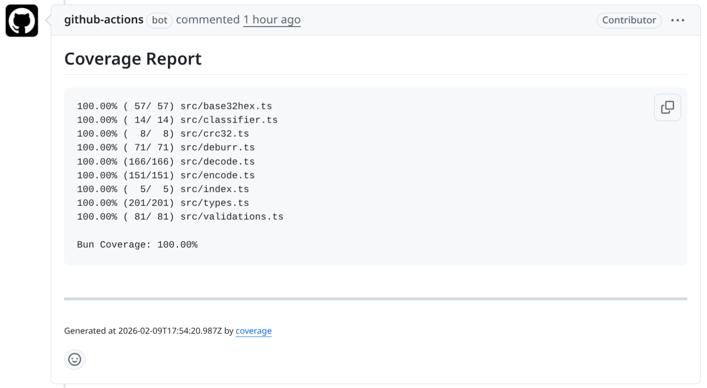
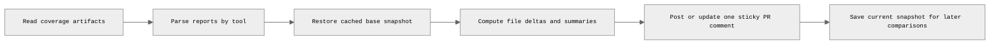

<h1 align="center">coverage</h1>

<p align="center">
	GitHub Action that parses coverage files and posts sticky PR comments with per-file deltas.
</p>

<p align="center">
	<a href="#features">Features</a> •
	<a href="#usage">Usage</a> •
	<a href="#inputs">Inputs</a> •
	<a href="#outputs">Outputs</a> •
	<a href="#generating-coverage-files">Coverage Files</a> •
	<a href="#development">Development</a>
</p>

## Why

Most coverage reporting actions require third-party services or complex setups.
This action works entirely within GitHub Actions using built-in cache, supports
multiple languages, and shows meaningful per-file diffs without external dependencies.

## Features

- Supports any LCOV-producing tool (Bun, Node.js, Jest, c8, nyc, Istanbul, PHPUnit, …) and Go coverage
- Shows per-file coverage deltas against base branch
- Single sticky PR comment (updates existing, no spam)
- Multi-workflow merging — separate workflows contribute to the same comment automatically
- Uses `@actions/cache` for cross-run comparison
- Supports explicit PR number overrides and optional commit links in the comment header
- Optional thresholds and fail-on-decrease
- Omits the top-level comparison block when a full baseline is not available for every tool
- No external services or tokens required

## Output example



## Usage

```yaml
- uses: xseman/coverage@v0.3.0
  with:
      coverage-artifact-paths: bun:coverage/lcov.info
```

With multiple tools and thresholds:

```yaml
- uses: xseman/coverage@v0.3.0
  with:
      coverage-artifact-paths: |
          bun:coverage/lcov.info
          go:coverage.out
      fail-on-decrease: true
      coverage-threshold: 80
```

Full workflow:

```yaml
name: Coverage
on: pull_request

jobs:
    test:
        runs-on: ubuntu-latest
        steps:
            - uses: actions/checkout@v6
            - uses: oven-sh/setup-bun@v2
            - run: bun install
            - run: bun test --coverage --coverage-reporter=lcov

            - uses: xseman/coverage@v0.3.0
              with:
                  coverage-artifact-paths: bun:coverage/lcov.info
```

### Multi-workflow setup

When TypeScript and Go (or any other combination) tests run in separate workflows,
use the **same `update-comment-marker`** value in both. The second workflow to finish
will find the first comment, read its embedded tool data, merge the results, and
update the comment in place — producing one combined report.

```yaml
# typescript-quality.yml
- uses: xseman/coverage@v0.3.0
  with:
      update-comment-marker: "<!-- coverage-reporter-sticky -->"
      coverage-artifact-paths: bun:typescript/coverage/lcov.info

# go-quality.yml
- uses: xseman/coverage@v0.3.0
  with:
      update-comment-marker: "<!-- coverage-reporter-sticky -->"
      coverage-artifact-paths: go:go/coverage.out
```

If both workflows run at the same time and there is no existing comment yet, both
may create their own comment. On the next commit push they will converge to one.
Use workflow dependencies (`needs:`) or `concurrency` groups if immediate
convergence on the first push is required.

## How it works


```mermaid
---
config:
  theme: neutral
  themeVariables:
    fontFamily: monospace
    fontSize: "10px"
---

flowchart LR
  A[Read coverage artifacts] --> B[Parse reports by tool]
  B --> C[Restore cached base snapshot]
  C --> D[Compute file deltas and summaries]
  D --> E[Post or update one sticky PR comment]
  E --> F[Save current snapshot for later comparisons]
```

Each `<tool>:<path>` entry goes through this pipeline independently. Results
are combined into one PR comment. The action caches parsed coverage as JSON
via `@actions/cache` using key `{prefix}-{tool}-{branch}-{sha}`, restoring
by prefix match to find the latest base-branch snapshot.

When the same `update-comment-marker` is used across multiple workflows, each
run reads the previously embedded tool reports from the existing comment, merges
its own results in (current tool takes priority), and rewrites the comment with
the combined data.

If every tool has a comparable base snapshot, the comment also includes an
overall base vs head summary. If some tools do not have cached base data yet,
the action still shows the per-tool sections and any available file deltas,
but skips the top-level comparison block so partial baselines do not distort
the summary. A note in the comment identifies which tools are missing a
baseline.

### Bootstrapping the cache

The diff table compares head coverage against a cached snapshot from the target
branch. On the first run (or when introducing a new tool) there is nothing to
compare against, so deltas are omitted. The cache is seeded automatically when
the workflow runs on a push to the base branch.

To get diffs working immediately:

1. Make sure the workflow triggers on **push** to the base branch (not just
   `pull_request`), so coverage is cached after each merge.
2. For a cold start, trigger the workflow manually on the base branch with
   `workflow_dispatch`:

```yaml
on:
    push:
        branches: [master]
    pull_request:
        branches: [master]
    workflow_dispatch: {}
```

Then run the workflow from the Actions tab on the base branch. The next PR
will find the cached snapshot and show full deltas.

## Inputs

| Input                     | Default                             | Description                                        |
| ------------------------- | ----------------------------------- | -------------------------------------------------- |
| `coverage-artifact-paths` | _(required)_                        | Newline or comma-separated `<tool>:<path>` entries |
| `pull-request-number`     | auto-detected                       | Explicit PR number override for comment updates    |
| `show-commit-link`        | `on`                                | Include commit link(s) at the top of the comment   |
| `base-branch`             | PR base ref                         | Branch for delta comparison                        |
| `cache-key`               | `coverage-reporter`                 | Cache key prefix                                   |
| `update-comment-marker`   | `<!-- coverage-reporter-sticky -->` | HTML marker for sticky comment                     |
| `colorize`                | `on`                                | `[+]`/`[-]` delta markers (`on`/`off`)             |
| `fail-on-decrease`        | `false`                             | Fail if any file coverage decreases                |
| `coverage-threshold`      | `0`                                 | Minimum overall coverage % (0 = disabled)          |
| `github-token`            | `${{ github.token }}`               | Token for PR comments                              |

### Supported tools

| Tool      | Format           | Example                   |
| --------- | ---------------- | ------------------------- |
| `bun`     | LCOV             | `bun:coverage/lcov.info`  |
| `node`    | LCOV             | `node:coverage/lcov.info` |
| `lcov`    | LCOV (generic)   | `lcov:coverage/lcov.info` |
| `go`      | Go cover profile | `go:coverage.out`         |
| `gocover` | Go cover profile | `gocover:coverage.out`    |

## Outputs

| Output               | Description                                 |
| -------------------- | ------------------------------------------- |
| `overall-coverage`   | Overall coverage percentage (e.g., `82.50`) |
| `coverage-decreased` | `true` if any file coverage decreased       |
| `comment-id`         | ID of created/updated PR comment            |

## Generating coverage files

```bash
# Bun (produces LCOV)
bun test --coverage --coverage-reporter=lcov

# Node.js (produces LCOV)
node --test \
  --experimental-test-coverage \
  --test-reporter=lcov --test-reporter-destination=coverage/lcov.info \
  --test-reporter=spec --test-reporter-destination=stdout

# Go
go test -coverprofile=coverage.out ./...
```

## Related

- [@actions/cache](https://github.com/actions/cache)
- [@actions/core](https://github.com/actions/core)
- [@actions/github](https://github.com/actions/github)
- [Bun test coverage](https://bun.sh/docs/cli/test#coverage)
- [Go test coverage](https://go.dev/blog/cover)
